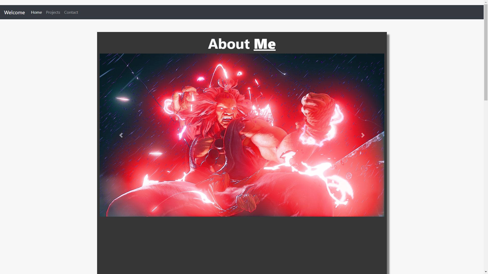

#  My Portfolio

## Table of Contents
* [Description](#description)
* [Technologies](#Technologies)
* [License](#license)
* [Contributors](#contributors)
* [Test](#test)
* [Questions](#questions)

## Description
My portfolio site to show what projects I have done and what i've been up too lately.

## Technologies
* React.js
* Bootstrap
* JSX
* Javascript

## License
No License

## Contributors
Kyle Johnson

## Test
(https://kjohnson3288.github.io/Portfolio/#/)

## Questions
If you want to contact me:

Github:(https://github.com/KJohnson3288)
